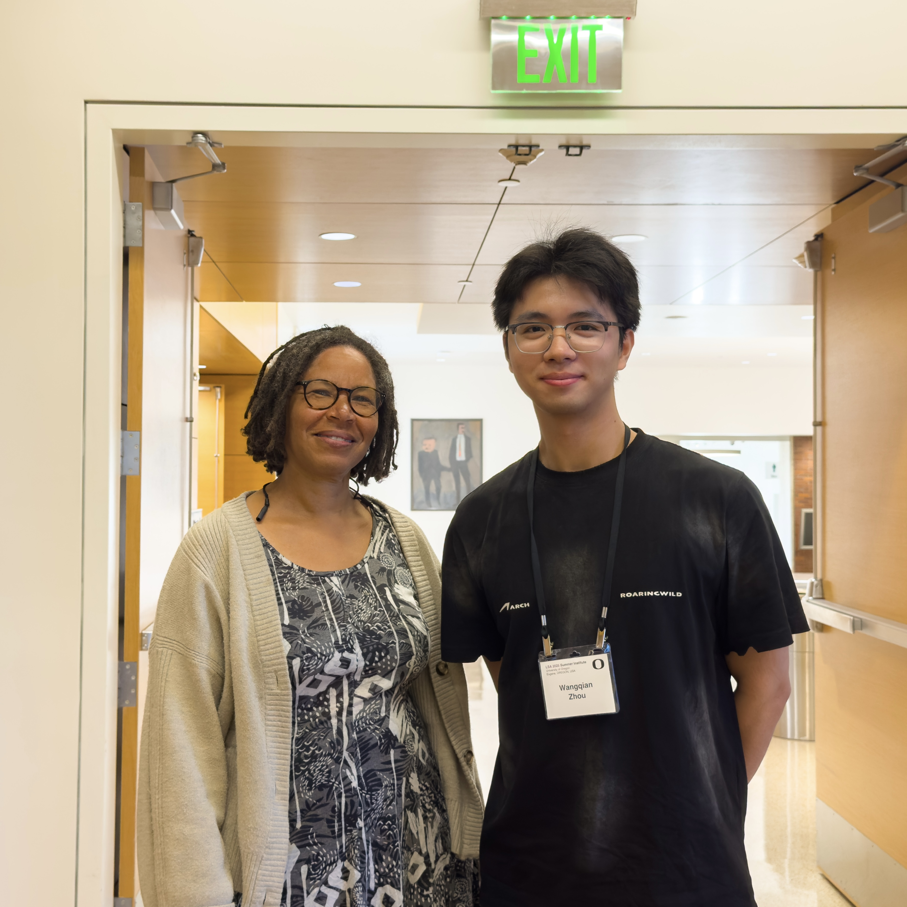
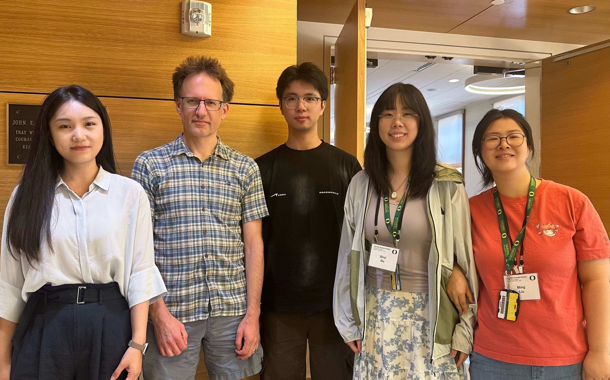
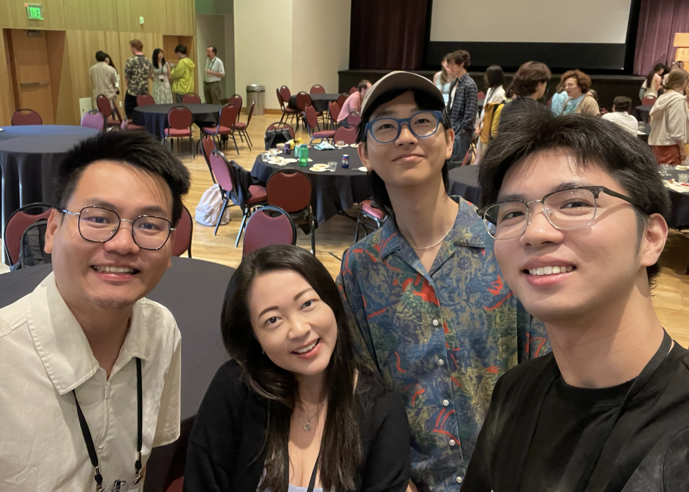
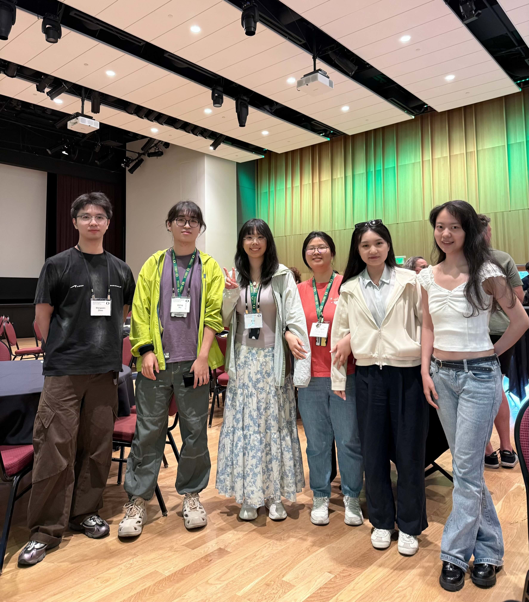
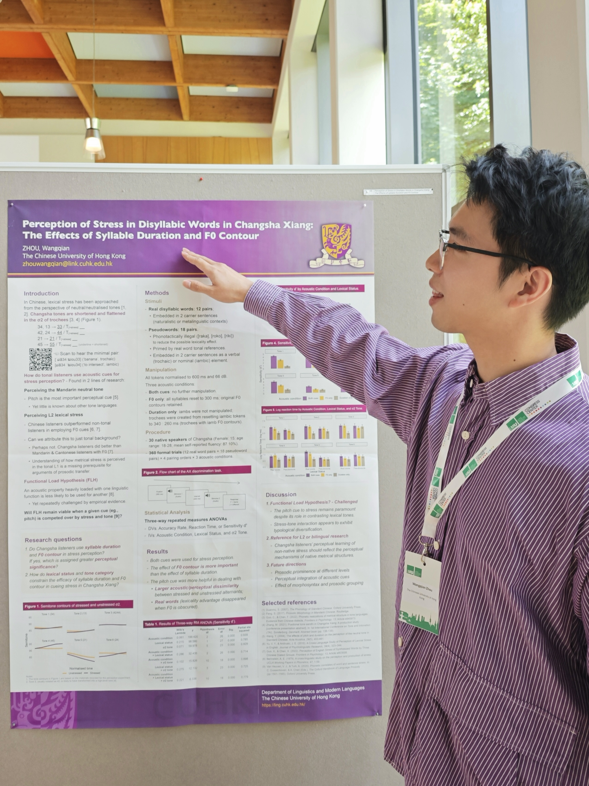
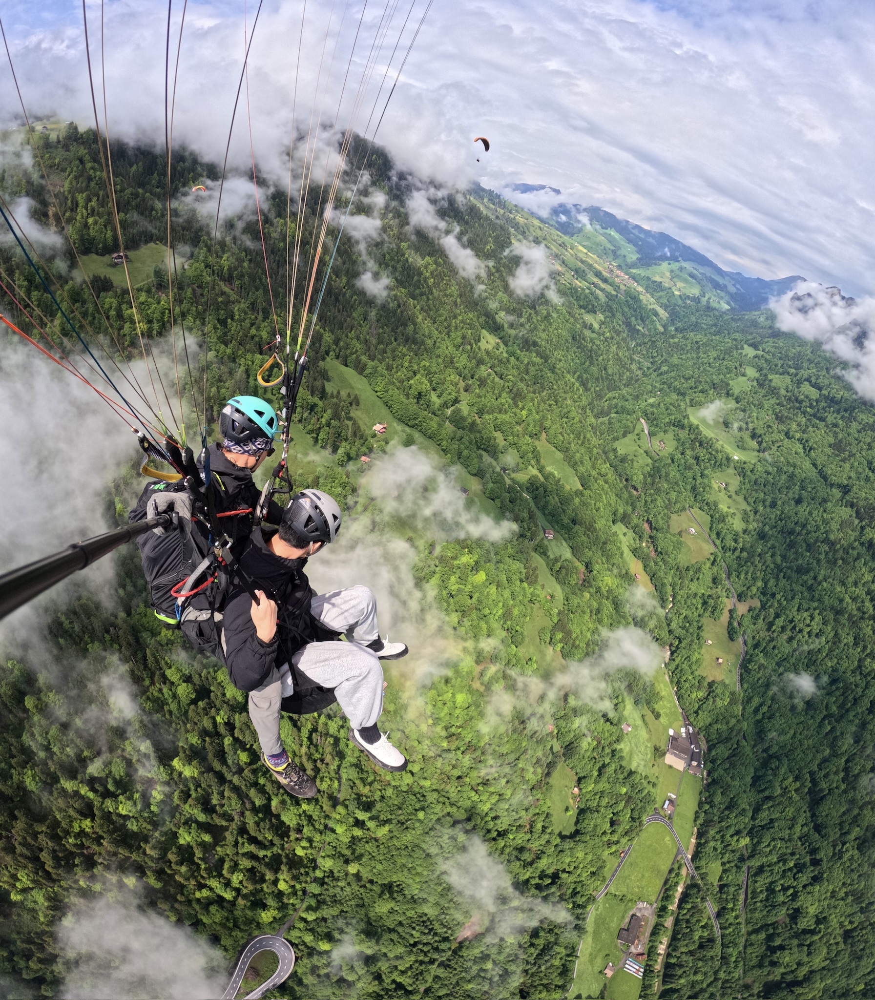

--- 

### July 2025

Spent the summer (my first LSA summer) in Eugene, Oregon.  
Made friends, had fun, and learnt a lot. 
Won first place in the Poster Session. 




---

### May 2025

Presented my paper at TAI2025 in Herrsching, Germany. 
Played table tennis with a bunch of linguists. 
Travelled around Bavaria and Switzerland.  
Soared in the Alps.





--- 

### August 2024

Officially joined CUHK. 
Went to the Fudan International Summer School of Linguistics
2024. 




---

### June 2024

Graduated from Beijing Foreign Studies University with the honorary title of Outstanding Graduate of Beijing (北京市優秀畢業生). 




